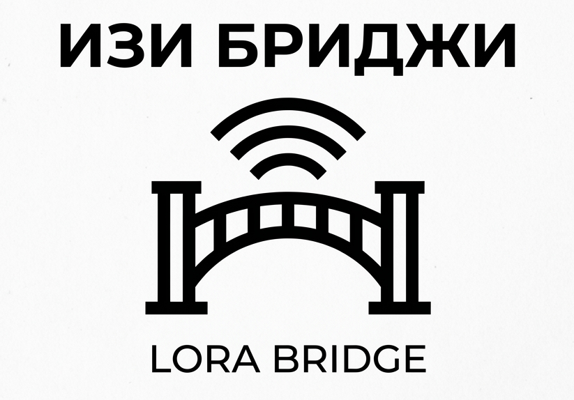

# EasyBridge (formerly LoRa Bridge)

Прошивка LoRa-мессенджера. Часть экосистемы **EasyLink**
(Android-приложение: `~/AndroidStudioProjects/EasyLink`,
веб-часть: `~/serverchik/lorachat*.py`).

## Что нового в V2.9

Четыре крупных изменения. Каждое описано в отдельном документе — здесь
только суть.

**Железо настраивается в рантайме** ([docs/HWCFG.md](docs/HWCFG.md)).
Раньше комбинация «чип + радио + дисплей» фиксировалась на этапе
сборки: «хочу C6 с Ra-02» означало правку заголовков и пересборку.
Теперь железо описывает структура в NVS, и один образ на чип
обслуживает любую распайку — включая цветные дисплеи и тачскрины.

**Веб-мост** ([docs/WEB_BRIDGE.md](docs/WEB_BRIDGE.md)). У сети
появляется веб-зеркало: кто за компом — пишет из браузера. Если
получателя нет в вебе, сообщение уходит ему по эфиру через
телефон-шлюз. Веб не заменяет LoRa, а дополняет её.

**Звонки с двумя плечами** (там же). В одном разговоре участвуют люди
с интернетом и люди без него: веб-участники слышат друг друга по
интернету, а тем, кого в вебе нет, голос уходит по FSK.

**Автономные устройства** ([docs/DEVICES.md](docs/DEVICES.md)).
Метеостанция, датчик дождя, реле в рюкзаке — узлы без телефона. Сами
рассказывают о себе, шлют показания и принимают команды.

## Платы

Заводские платы и типовые самосборы собраны в таблицу профилей в
`main/hwcfg.c` — это единственный источник правды о пинах. Из неё же
`tools/gen_profiles.py` генерирует таблицы подключения для страницы
прошивки.

| Профиль | Чип | Радио | Диапазон | Особенности |
|---|---|---|---|---|
| `s3_e220` | ESP32-S3 | E220-400T30D (UART) | 433 | оригинальная плата, 30 dBm |
| `c6_e220` | ESP32-C6 | E220-400T30D (UART) | 433 | |
| `t3_v161` / `_915` | ESP32 | SX1276 (SPI) | 868 / 915 | LilyGO T3: батарея, CAD/LBT |
| `s3_e22m33s` | ESP32-S3 | SX1268 (SPI) | 433 | 33 dBm, TCXO |
| `c6_ra02`, `s3_ra02` | C6 / S3 | SX1278 (SPI) | 433 | самосбор |
| `s3_sx1262_st7789` | ESP32-S3 | SX1262 | 868 | цветной IPS 240×240 |
| `s3_ili9341_touch` | ESP32-S3 | SX1278 | 433 | 320×240 + тач XPT2046 |
| `s3_e28_2g4` | ESP32-S3 | SX1280 | 2.4 ГГц | **драйвер-заглушка** |
| `s3_lora_halow` | ESP32-S3 | SX1262 + HaLow | 868 | **HaLow — заглушка** |

Профиль по умолчанию выбирается сборкой, но меняется из приложения
без перепрошивки.

## Сборка

Всё разом — прошивка на четыре платы, приложение и тесты веб-части:

```bash
./build_all.sh              # ~30 с, в конце сводка
./build_all.sh fw           # только прошивка
./build_all.sh --images     # + merged-образы для флешера
```

Экосистема живёт в трёх каталогах (`~/esp/lorabridge`,
`~/AndroidStudioProjects/EasyLink`, `~/serverchik`), и скрипт обходит
их сам. Пути переопределяются переменными `EASYLINK_DIR`,
`SERVERCHIK_DIR`, `IDF_EXPORT`.

Одну плату руками:

```bash
source ~/esp/esp-idf-v5.5.1/export.sh
idf.py -B build_t3_v161 -DSDKCONFIG=build_t3_v161/sdkconfig \
    -DSDKCONFIG_DEFAULTS="sdkconfig.defaults;sdkconfig.board_t3_v161" \
    -DIDF_TARGET=esp32 build
```

## Прошивка

- **CLI**: `python tools/flasher/flash.py [--board t3_v161] [--name Philip]`
- **Web**: `python -m http.server -d tools/flasher/web 8000` → Chrome →
  `http://localhost:8000` (там же схемы подключения по каждому профилю)

## Архитектура

- `main/hwcfg.*` — рантайм-описание железа: пины, радио, дисплей, тач,
  батарея. Валидатор ловит конфликты пинов и запрещённые GPIO.
- `main/radio_hal.h` + `radio_registry.c` — все драйверы радио в одном
  бинарнике, нужный выбирается при старте. FSK вынесен в отдельный HAL
  (`fsk_ops()`): от него зависит, возможны ли звонки по эфиру.
- `main/panel.*` — дисплей: монохромный кадр 128×64 выливается на
  SSD1306/SH1106 как есть, на ST7789/ILI9341 — с раскраской и
  масштабом.
- `main/touch.*` — XPT2046, FT6236, CST816, GT911.
- `main/devnode.*` — роль автономного датчика/реле.
- `main/proto25.*` — эфирный протокол: текст, ACK, GPS, SOS, группы,
  голосовые, mesh-relay, устройства.
- `main/ptt.c`, `main/imgfsk.c` — звонки и картинки по GFSK.
- `main/jsonlite.*` — общий разбор JSON для конфигов.
- Анти-коллизии: relay-джиттер 50–500 мс с отменой по чужому эху,
  LBT/CAD перед TX (SPI-радио), рандомизация межфрагментных пауз.
- Шифрование эфира: AES-128-CTR над payload, ключ = SHA-256(passphrase).

## Документация

| Документ | О чём |
|---|---|
| [docs/HWCFG.md](docs/HWCFG.md) | Конфигурация железа, профили, валидатор, BLE-команды |
| [docs/WEB_BRIDGE.md](docs/WEB_BRIDGE.md) | Веб-мост и звонки — **спецификация для EasyLink** |
| [docs/DEVICES.md](docs/DEVICES.md) | Автономные датчики, виджеты, кнопки-плагины |
| [docs/VOICE_PTT_FSK.md](docs/VOICE_PTT_FSK.md) | Дизайн FSK-рации |
| [docs/ARCHITECTURE.html](docs/ARCHITECTURE.html) | Разбор кода с иллюстрациями (V2.6–V2.8) |
| [TODO.MD](TODO.MD) | Найденные баги, план проверки на железе, ограничения |

## Состояние

V2.9 собрана на все четыре платы, приложение собирается, серверная
часть покрыта 108 тестами — и **на живом железе не проверялась ни одна
часть**. Что именно проверять и в каком порядке — в конце
[TODO.MD](TODO.MD).

Android-мост (`~/AndroidStudioProjects/EasyLink`) написан и собирается;
перекодирование звука писалось вслепую, и первый живой звонок,
вероятно, потребует правок.
